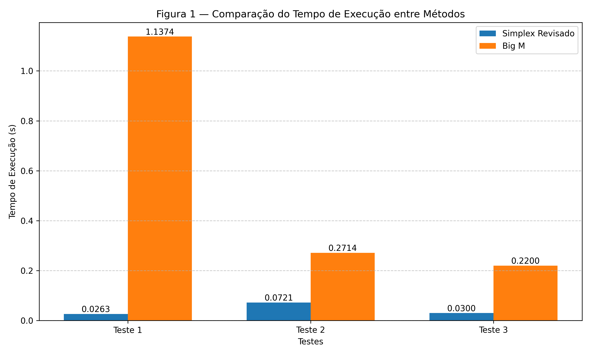
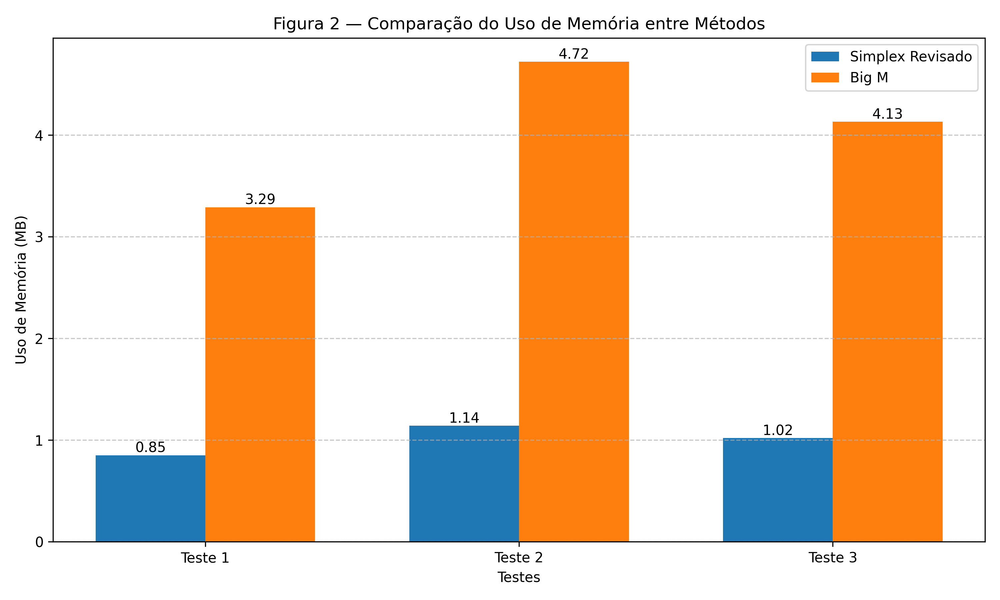

# **Linear Optimization Methods Comparison**


Este repositório contém o código e os recursos utilizados no artigo **"Comparação de Métodos de Otimização Linear: Simplex Revisado vs. Big M"**. O objetivo é comparar o desempenho computacional do método simplex revisado e do método Big M em problemas de Programação Linear (PL) de diferentes escalas, utilizando Python e bibliotecas como PuLP e SciPy.

---

## **Sumário**
1. [Visão Geral](#visão-geral)
2. [Métodos Implementados](#métodos-implementados)
3. [Instalação](#instalação)
4. [Uso](#uso)
5. [Resultados](#resultados)
6. [Licença](#licença)
7. [Contato](#contato)

---

## **Visão Geral**
Este projeto visa analisar a eficiência computacional de dois métodos amplamente utilizados em Programação Linear:
- **Método Simplex Revisado**: Uma versão otimizada do método simplex tradicional, que utiliza operações matriciais para reduzir o custo computacional.
- **Método Big M**: Uma técnica que introduz variáveis artificiais e penalidades na função objetivo para lidar com restrições específicas.

O repositório inclui scripts em Python para gerar problemas de PL, resolver problemas com ambos os métodos e comparar métricas como tempo de execução, uso de memória e número de iterações.

---

## **Métodos Implementados**
### **1. Método Simplex Revisado**
- Implementado usando a função `linprog` da biblioteca SciPy, com o solver HiGHS.
- Adequado para problemas de grande escala devido à sua eficiência numérica.

### **2. Método Big M**
- Implementado manualmente usando a biblioteca PuLP, com o solver CBC.
- Inclui penalizações para variáveis artificiais, garantindo que sejam eliminadas da solução ótima.

---

## **Instalação**
Para executar os scripts deste repositório, siga as etapas abaixo:

1. Clone o repositório:
   ```bash
   git clone https://github.com/Boudenzin/linear-optimization-methods-comparison.git
   cd linear-optimization-methods-comparison
   ```

2. Crie um ambiente virtual (opcional, mas recomendado):
   ```bash
   python -m venv venv
   source venv/bin/activate  # No Windows: venv\Scripts\activate
   ```

3. Instale as dependências:
   ```bash
   pip install -r requirements.txt
   ```

---

## **Uso**
O repositório contém vários scripts de código, escolha o que quer executar.

### **Executando o Script**
```bash
python [nome-do-arquivo].py
```

### **Exemplo de Saída**
```plaintext
Tempo de execução: 0.125915 s
Uso de memória: 0.589844 MB
Valor ótimo encontrado: 7.000000
x = 3.000, y = 2.000, a1 = 0.000

```

---

## **Resultados**
Os resultados da comparação são apresentados em tabelas e gráficos, destacando:
- Tempo de execução.
- Uso de memória.

### **Gráficos**
  
*Tempo de execução dos métodos em diferentes escalas de problemas.*

  
*Uso de memória dos métodos em diferentes cenários.*

> 💡 Para alternar entre versões coloridas e preto-e-branco nos gráficos, os scripts permitem modificar os parâmetros de cor com facilidade (veja comentários nos arquivos de geração de gráficos).


---

## **Licença**
Este projeto está licenciado sob a licença MIT. Consulte o arquivo [LICENSE](LICENSE) para mais detalhes.

---

## **Contato**
Para dúvidas, sugestões ou colaborações, entre em contato:
- **Nome**: [Romildo Rodrigues da Silva Regis Júnior]
- **E-mail**: [romildo-rrj@hotmail.com]
- **GitHub**: [Boudenzin](https://github.com/Boudenzin)
