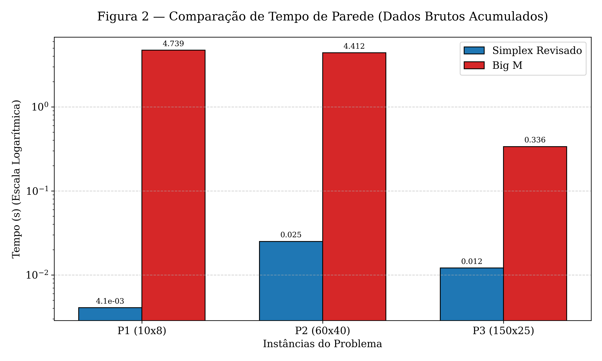
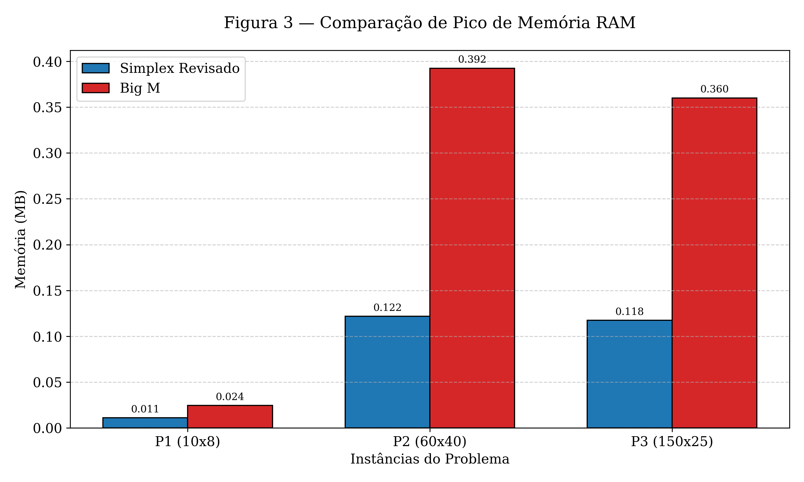

# **Linear Optimization Methods Comparison**


Este repositório contém o código e os recursos utilizados no artigo "Comparação de Métodos de Otimização Linear: Simplex Revisado vs. Big M". O objetivo é comparar o desempenho computacional do método simplex revisado e do método Big M, utilizando um ambiente controlado e métricas de alta precisão.

### **Execução com Isolamento de Hardware**

Para garantir a reprodutibilidade dos resultados apresentados no artigo, recomenda-se o uso de Docker com limites rigorosos de recursos:

```bash
# 1. Build da imagem
docker build -t simplex-comparison .

# 2. Execução com limites (Isolamento de 1 CPU e 512MB RAM)
docker run --rm --cpus="1.0" --memory="512m" --name run_benchmark simplex-comparison
```


---

## **Sumário**
1. [Visão Geral](#visão-geral)
2. [Métodos Implementados](#metodologia-de-benchmark)
3. [Métodos Implementados](#metodos-implementados)
3. [Problemas Detalhados](#problemas-detalhados)
4. [Instalação](#instalação)
5. [Uso](#uso)
6. [Resultados](#resultados)
7. [Licença](#licença)
8. [Contato](#contato)

---

## **Visão Geral**
Este projeto visa analisar a eficiência computacional de dois métodos amplamente utilizados em Programação Linear:
- **Método Simplex Revisado**: Uma versão otimizada do método simplex tradicional, que utiliza operações matriciais para reduzir o custo computacional.
- **Método Big M**: Uma técnica que introduz variáveis artificiais e penalidades na função objetivo para lidar com restrições específicas.

O repositório inclui scripts em Python para gerar problemas de PL, resolver problemas com ambos os métodos e comparar métricas como tempo de execução, uso de memória e número de iterações.

---

## **Metodologia de Benchmark**

Diferente de testes convencionais, este repositório utiliza uma metodologia de **diluição de ruído estatístico**:

  - **Amostragem**: Cada problema é avaliado em 30 amostras independentes.
  - **Repetições Internas**: Problemas de execução ultrarrápida são executados em laços de 100 a 1.000 iterações para superar a latência do relógio do sistema.
  - **Métricas**:
      - **CPU Time (`process_time`)**: Tempo real de esforço do processador, ignorando interrupções do sistema.
      - **Wall Time (`perf_counter`)**: Tempo total transcorrido (relógio de parede).
      - **Peak RAM (`tracemalloc`)**: Pico máximo de alocação de memória durante a resolução.


---

## **Métodos Implementados**

### **1. Método Simplex Revisado**

  - Implementação baseada em bibliotecas de alto desempenho como `scipy.linalg` e `numpy`.
  - Foco em problemas de média e grande escala.

### **2. Método Big M**

  - Implementação customizada para fins de benchmark acadêmico.
  - Ajustada para evitar saídas de console (*logs* de iteração) que possam interferir na medição de tempo e memória.

-----


---

## Problemas Detalhados

Para detalhes completos das formulações matemáticas dos três problemas utilizados nos testes, incluindo funções objetivo, restrições e soluções ótimas, consulte o arquivo [problemas_detalhados.md](problemas_detalhados.md).


---

## **Instalação**
Para executar os scripts deste repositório, siga as etapas abaixo:

1.  Clone o repositório:

    ```bash
    git clone https://github.com/Boudenzin/linear-optimization-methods-comparison.git
    cd linear-optimization-methods-comparison
    ```

2.  O ambiente é gerenciado via Docker. Para trocar o teste executado, altere o `CMD` no `Dockerfile`:

    ```dockerfile
    FROM python:3.9-slim
    WORKDIR /app
    COPY . .
    RUN pip install numpy scipy
    CMD ["python", "revised-simplex/problema1.py"]
    ```

---

## **Resultados**
Os resultados são consolidados em relatórios acadêmicos que incluem a média aritmética e o **RSD (Desvio Padrão Relativo)**, garantindo que os dados não sofreram interferência de processos em segundo plano.

### **Visualização de Desempenho**

O repositório gera gráficos em escala logarítmica para permitir a comparação visual de ordens de magnitude distintas:


### **Gráficos**
  
*Tempo de execução dos métodos em diferentes escalas de problemas.*

  
*Tempo de execução do Wall Clock dos métodos em diferentes cenários.*

  
*Uso de memória dos métodos em diferentes cenários.*

> 💡 Para alternar entre versões coloridas e preto-e-branco nos gráficos, os scripts permitem modificar os parâmetros de cor com facilidade.


---

## **Licença**
Este projeto está licenciado sob a licença MIT. Consulte o arquivo [LICENSE](LICENSE) para mais detalhes.

---

## **Contato**
Para dúvidas, sugestões ou colaborações, entre em contato:
- **Nome**: [Romildo Rodrigues da Silva Regis Júnior]
- **E-mail**: [romildo-rrj@hotmail.com]
- **GitHub**: [Boudenzin](https://github.com/Boudenzin)
